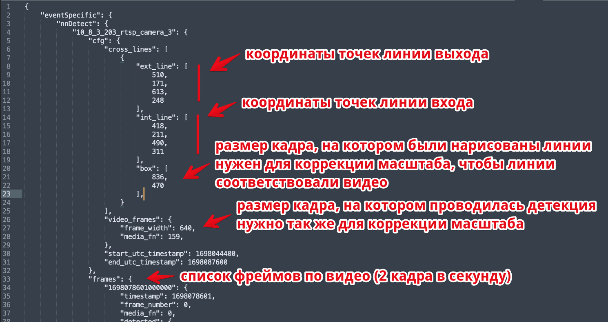
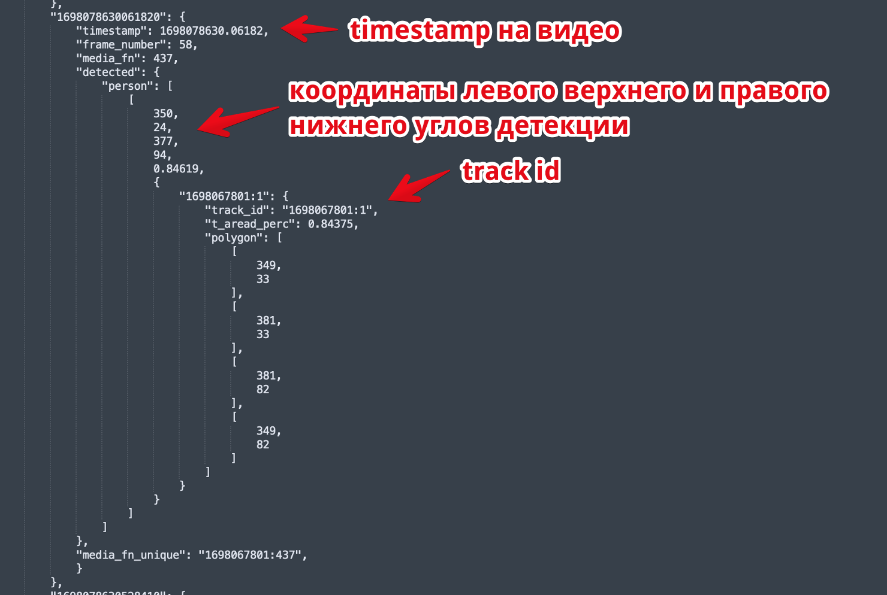

# ShopFlowCounter: ваш надежный помощник в подсчете посетителей в магазине!"

## Инструкция для запуска проекта.

### 1. Сделать клон проекта "git clone https://github.com/AppleIpx/ShopFlowCounter.git"
### 2. Создать виртуальное окружение:
#### 2.1 Создание и активация на Mac:
- Выполняем следующую команду "python3 -m venv название_вашего_окружения"
- Выполняем следующую команду "source название_вашего_окружения/bin/activate"
#### 2.2 Создание и активация на Windows:
- Создаем новую папку с названием виртуального окружения
- Выполняем следующую команду "название_папки_с_виртуальным_окружением\Scripts\activate.bat"
### 3. Установка необходимых библиотек:
- Выполняем следующую команду "pip install -r requirements.txt"
### Программа готова к запуску

## Техническое задание (ТЗ)

## 1. Введение

### 1.1 Описание проекта

- ShopFlowCounter - это программа, разработанная для эффективного отслеживания и учета посетителей в магазине.
Цель - предоставить пользователям инструмент для мониторинга потока клиентов, а также для анализа и оптимизации процессов в магазине.

## 2. Задание:
- Определить, как именно правильней регистрировать считать выход и выход по видеофайлу.
На основе данных о траекториях людей и координатах линии входа нужно посчитать количество входящих и выходящих людей.

### 2.1 Входные данные: 
- Будет предоставлено видео (video.mp4) длительностью в 1 час 
с камеры мебельного магазина. Камера направлена 
на вход в магазин. На видео люди входят в салон и выходят из него. 
Также представлен файл detections.json с детекциями людей, 
рассчитанный нейронкой. И координаты линий для определения входа/выхода.

### 2.2 Дополнительные условия:
- Детекция и трекинг уже сделаны (отслеживание траекторий) людей в файле. Каждый «квадрат» имеет id.
С помощью этого id нужно отследить, если тот же человек (тот же id квадрата) зайдет еще раз и не засчитать.

### 2.3 Описание формата файла:
- 
- 

### 2.4 Результат задачи:
- Алгоритм может посчитать правильное количество посетителей в магазине и выдать количество входов/выходов.

## 3. Требования к проекту:

### 3.1 Для безупречной работы программы требуется учесть несколько важных моментов:

1. Оптимальное время запуска:
- Запускайте программу в периоды, когда в магазине отсутствуют посетители. Это гарантирует точность отображения данных, избегая возможности отрицательного значения количества посетителей в магазине.

2. Уникальная идентификация посетителей:
- Для более точных результатов программы важно различать одних и тех же посетителей, определенных нейросетью. Уточните систему идентификации, чтобы избежать ошибок в подсчете и предоставить более точные ответы.

3. Учет множественных выходов:
- При наличии нескольких выходов из магазина уточните эту информацию. Программа должна быть настроена на учет различных точек выхода для достоверного подсчета посетителей и обеспечения точности данных.

Исходя из этих рекомендаций, программа будет способна предоставлять более точные и надежные результаты в контексте отслеживания посетителей в магазине.

